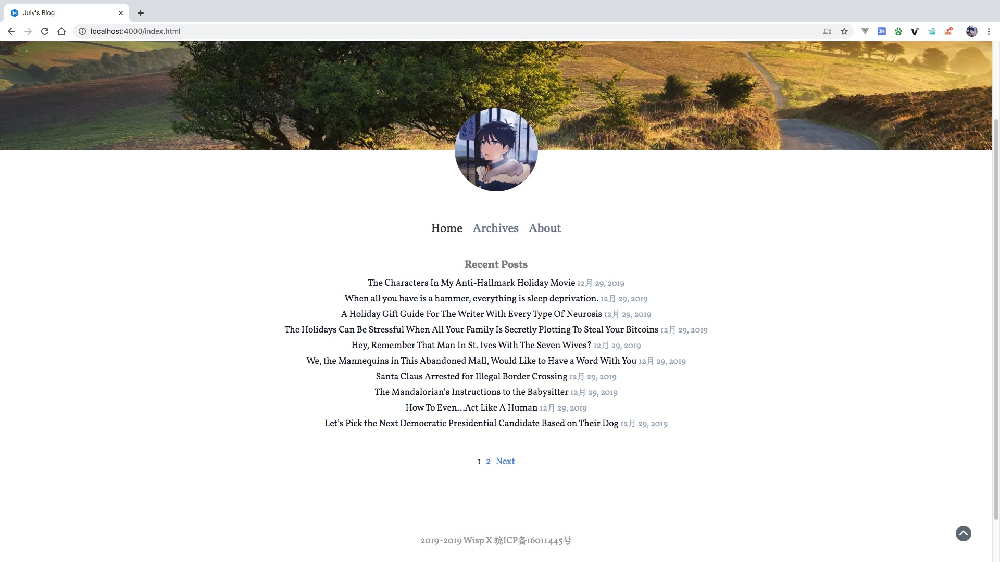

<h1 align="center">July</h1>

<h3 align="center">A minimalist, focused writing Hexo theme.</h3>

<p align="center">
  
  
  <a href="https://travis-ci.org/Shen-Yu/hexo-theme-ayer?branch=master" target="_blank" rel="noopener noreferrer">
    
  </a>
  <a href="http://standardjs.com" target="_blank" rel="noopener noreferrer">
    
  </a>
  <a href="https://github.com/Shen-Yu/hexo-theme-ayer/releases" target="_blank" rel="noopener noreferrer">
    
  </a>
 
</p>

---

<center></center>

Install
---
```
$ git clone https://github.com/wisp-x/hexo-theme-july.git themes/july
```

Enable
---
Modify theme setting in _config.yml to july
```
...
theme: july
...
```

Disable
---
The july theme has a built-in highlight plug-in. In order to avoid conflicts, you need to turn off the highlight of the system.
```
...
highlight:
  enable: false
...
```

Create Page
---
```
$ hexo new page about
```

Update
---
```
cd themes/july
git pull
```

Configuration
---
```
# html lang
language: zh-CN

# main menu navigation
menu:
  Home: /index.html
  Archives: /archives/index.html
  About: /about/index.html

site:
  # banner: /img/banner.jpg # banner map of website. (please annotation this line if you don't need it)
  avatar: https://www.gravatar.com/avatar/7a585313ed855e8d652cbb3154a6056e?s=300&d=mm&r=g # head portrait.
  icp: 皖ICP备16011445号 # E-ICP prepared No.

# stylesheets loaded in the <head>
stylesheets:
  - /css/markdown.css
  - /css/july.css

# scripts loaded in the end of the body
scripts:
  - /js/jquery-3.4.1.min.js
  - //cdn.bootcss.com/highlight.js/9.13.1/highlight.min.js
  - /js/transition.js
  - /js/smooth-scroll.min.js

hljs:
  enable: true # true to enable the plugin
  line_number: false # add line_number in frontend or backend (not recommend, have bugs in special hexo version)
  trim_indent: backend # trim the indent of code block to prettify output. backend or front-end (recommend)
  copy_code: true # show copy code in caption.
  label:
    left: Code
    right: ':'
    copy: Copy Code

# atom: atom.xml # website feed.
```

Licence
---
MIT
